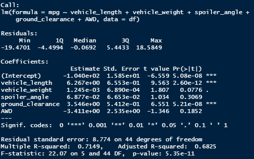
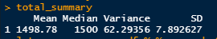
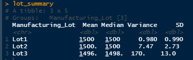
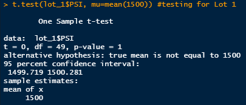
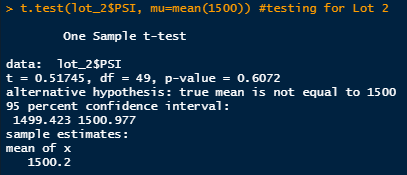
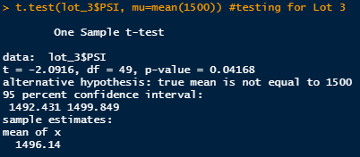

# MechaCar_Statistical_Analysis

We are analyzing the production problem of the newest car prototype (MechaCar) by doing Statistical Analysis using R. We will be doing different analysis with our dataset to see if we can find out the relationships between different factors that affect MPG, suspension, manufacturing process and the population as a whole.

## Linear Regression to Predict MPG.

Using summary statistics with our dataset, we get the following output:

</img>

This linear regression addresses the following questions:

- The vehicle length and ground clearance provides a non-random amount of variance to the mpg values in the dataset. In other words, they have a very negligible relation with the MPG factor for the MechaCars
    
- It seems that with an assumed P value of 0.05%, the slope is not zero, as the p value is really small (5.35e-11). This means there is sufficient evidence to reject out null hypothesis that the slope is zero.  
  
- Overall, this dataset only helps us to predict 71% of the MPG of MechaCar prototypes as shown by our Multiple R-Squared value of 0.7149 , which means around 29% of the MPG factors will be outside the predictive model provided by our Linear model.

## Summary Statistics on Suspension Coils

We are running a summary statistics on the dataset from multiple production lots for suspension coils to find out if they conform to the variance of 100 PSI.

If we run a summary statistics on the total suspension coil dataset, we can see that the overall production lots are well within the variance range of 100 PSI.

</img>

However, if we run a individual analysis on the lots we can see that Lot 1 and Lot 2 conformed really well as both lots' variance is below 10, whereas Lot 3 seems to have some trouble as its variance is 170, which indicates that it had some quality issues for the PSI factor.  

</img>

## T-Tests on Suspension Coils

After we run a summary statistics for the suspension coils, we are also testing them using T tests against the population mean of 1500 PSI to see whether the summary statistics and the T test show the same result.

When we run the T test on the overall suspension data, it shows a Mean of 1498.78 and a P value of 0.06, which means that statistically the population mean and the overall dataset mean are not different. 

</img>

When we run the T test on Lot 1's suspension data, it shows a Mean of 1500 and a P value of 1, which means that statistically the population mean and the overall dataset mean are not different.

</img>

Again, When we run the T test on Lot 2's suspension data, it shows a Mean of 1500.2 and a P value of 0.6072, which means that statistically the population mean and the overall dataset mean are not different.

</img>

However, when we run the T test on Lot 3's suspension data, it shows a Mean of 1496.14 and a P value of .04168, which means that statistically the population mean and the overall dataset mean <B>are different</B>.

</img>

All of these conform with the summary statistics that we ran in the previous step.

## Study Design: MechaCar vs Competition

After we test our data internally against our standards, it would be also useful to test them against the industry that we are in.

For example, we can focus on any of the metric that an inquisitive customer would be interested to know and compare that factor against our production dataset. One initial metric can be <B> Safety Rating</B>, which can be found from the <a src="https://www.nhtsa.gov/content/nhtsa-ftp/251">NHTSA website</a>. This has information for fatality analysis by year, and we can test and compare that against our chosen vehicle type to see whether the crash conditions impact our vehicle owner the same way that the target vehicles do.

Our <B>Null Hypothesis</B> will be: The Mean Impact Score (MIS) for our vehicle is not statistically different than a target vehicle's Mean Impact score(MIS).

The main test that we should perform here will be <B>T Test</B>, as this can compare means between two samples to check whether they are statistically different or not. We would be taking the <B>MIS</B> for our cars and compare that with the target vehicle's MIS.

To make the comparison, we would have to  run some tests to see whether our cars, crashed at certain speed levels, impacts the driver for certain levels (disabling, minor, superficial etc.). After the run the tests, we can use that dataset to calculate our MIS for different speed level, different weight level etc. And finally, we can compare that with the target vehicle group's MIS for different speed levels or weight level.
 